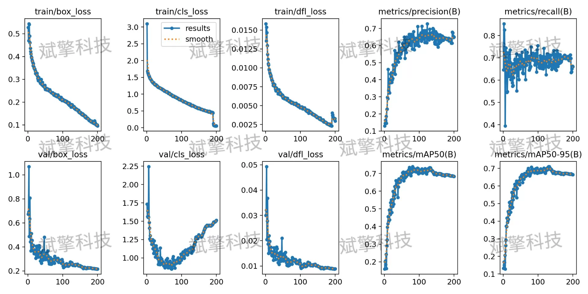
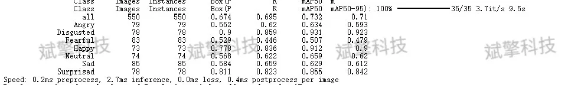
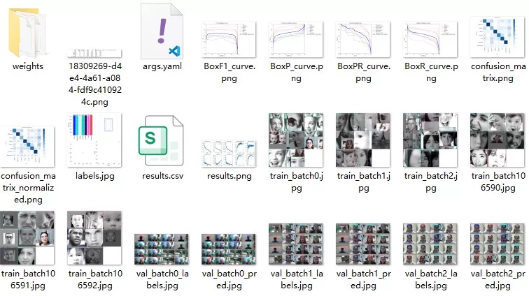
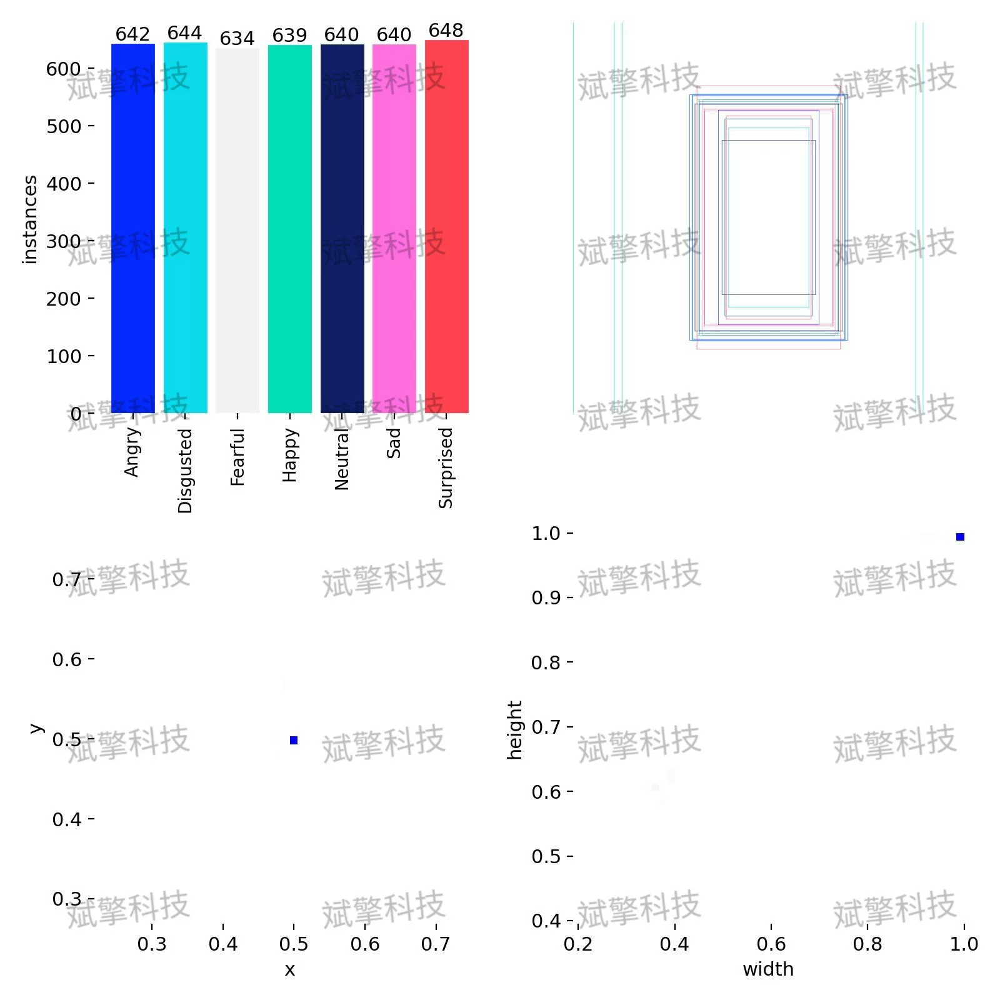
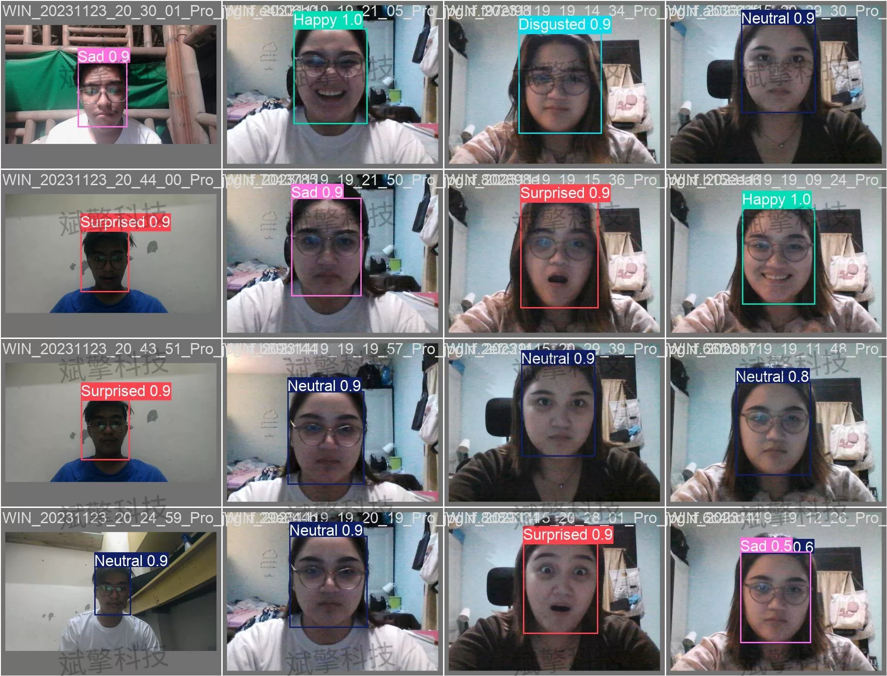
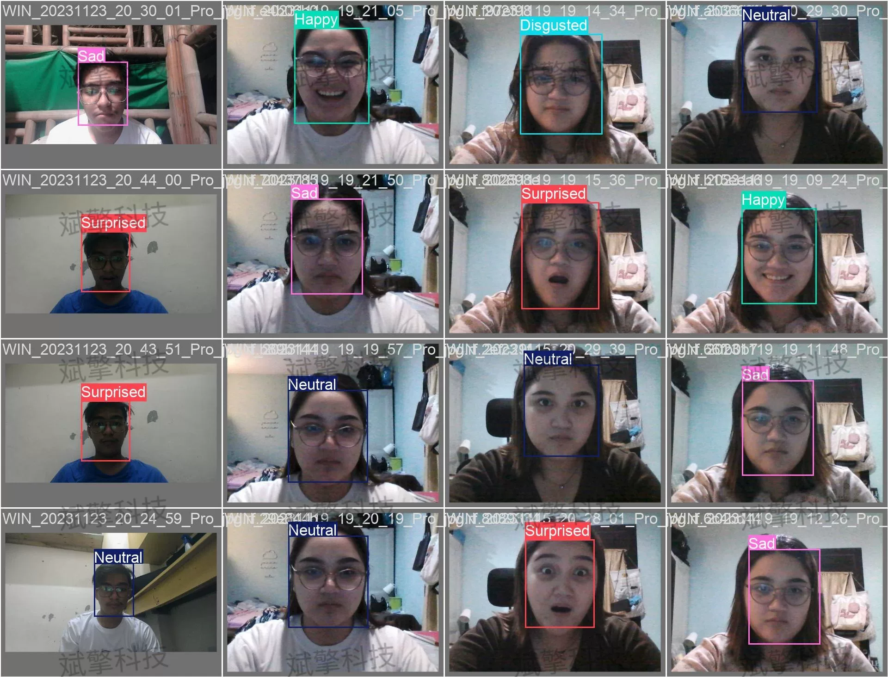
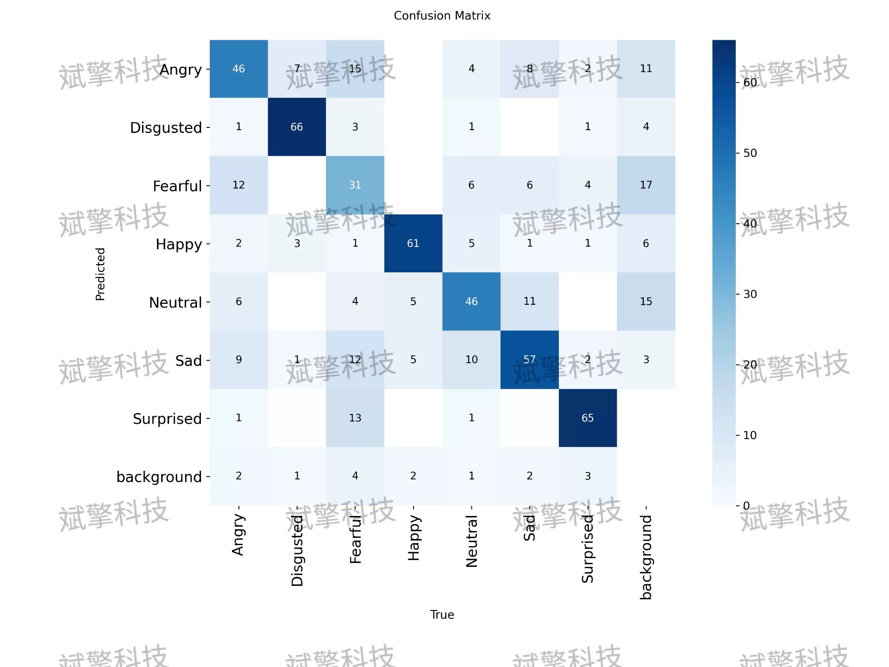

# YOLO26 Emotion Recognition System | Source Code + UI Interface

## Body

YOLO26 Emotion Recognition System | Source Code + UI Interface Based on YOLO26 for Real-Time Emotion Recognition (7 Types of Emotions/5600 Images/Anger/Disgust/Fear/Happiness/Neutral/Sad/Surprise)

This study builds and trains a facial emotion recognition detection system targeting seven basic emotions (Anger/Disgust/Fear/Happiness/Neutral/Sad/Surprise). The experimental dataset consists of more than 5600 images, divided into training set (4483), validation set (550), and test set (566). The training results show that the model achieved good convergence on the validation set. Among the categories, "Disgusted" (Disgusted) and "Happiness" (Happy) had extremely high recognition accuracy, with mAP reaching 93.1% and 91.2%, respectively. The confusion matrix analysis shows that the model has some confusion in distinguishing between "Fear" and "Sad", "Anger" and "Neutral". Overall, this system achieves a good balance between real-time performance and accuracy, but there is still room for optimization in handling subtle differences in facial expressions and samples with high inter-class similarity.

Category definition (nc=7):
Angry (Anger)
Disgusted (Disgusted)
Fearful (Fear)
Happy (Happiness)
Neutral (Neutral/Pleasant)
Sad (Sad)
Surprised (Surprise)
The dataset contains about 5600 images, divided into three parts according to the standard process of machine learning to ensure the objectivity of model evaluation:
Training Set (Training Set): containing 4483 images.
Validation Set (Validation Set): containing 550 images.
Test Set (Test Set): containing 566 images.

Free appointment for remote installation. Unsuccessful full refund.
Purchase Enjoy the following resources (Baidu Drive automatically unlocked)
YOLO Recognition Detection Project Complete Source Code
YOLO format Data Set
Training Code + UI Interface Code
Trained Model + Results Image
Software Installation Package
Add WeChat to make an appointment for remote installation (Automatically display WeChat ID after purchase) - Unsuccessful, full refund

⚙️ Core Functional Modules
Detection Capability
Image Detection: Upon upload, return detection boxes + category information
Video Detection: Support video files, analyze accurately per frame
Camera Real-Time Detection: Integrate USB camera, realize dynamic monitoring
Interaction and Control
Target Filtering: Choose one or more categories for detection
Parameter Real-Time Adjustment: Adjustable confidence threshold & IoU threshold, flexibly control precision
Result Save: One-click save image/video/camera detection results
System and Data
User Login and Registration: Support password strength detection + Encrypted storage
Log Recording: Auto record operation and error information (timestamp)

## Images

## Payment

Here is a pay link on Stripe ( https://buy.stripe.com/3cs8yP7sY87d0vu9AB ). Please contact me lonlonago@foxmail.com after funding $89, and I will send you a complete data files , thank you!

